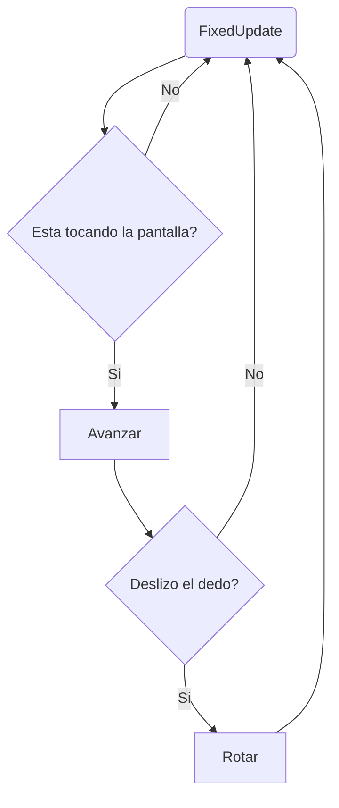

# Guia para crear Prototipos de a partir de un juego preexistente

*Crear un prototipo a partir de un juego preexistente*
*Conocer algunas Interfaces útiles de Unity*
*Crea tu protafolio!*
**Pre requisitos:** Tener experiencia básica en Unity o haber tomado este curso [https://platzi.com/cursos/desarrollo-unity/](https://platzi.com/cursos/desarrollo-unity/) 

En este tutorial vamos a crear un prototipo a partir de un juego publicado en IOS. Este prototipo será desarrollado con la versión LTS de Unity 2018.4.12f1, pero no hay problema si usas una versión avanzada. 

Veamos este vídeo
[https://drive.google.com/drive](https://drive.google.com/drive/folders/1tI-TKiZB2RhK8RejxKIn9i39LYd6mPTo?usp=sharing)


## Break down
 Si quieres hacer un prototipo basado en un juego existente, debes analizar paso a paso sus mecánicas. Por ello, te recomiendo que te hagas las siguientes preguntas: 
 - ¿Cómo crees que funciona su mecánica principal? 
 - ¿Cómo crees que funcionan los controles? 
 - ¿Como lo harías tú?

 Como futuro desarrollador de videojuegos, debes comenzar a analizar tus experiencias como jugador. Es muy útil hacer este pequeño ejercicio cada vez que te sientas interesado por algún juego. Esto te ayudará a crear hábitos de un verdadero desarrollador  de videojuegos.

 Ahora que haz analizado estas preguntas, debes pensar en como dividir las mecánicas en pequeños trozos que sean sencillos de implementar y rápidos de testear. 

> En este tutorial nos centraremos en el apartado de mecánicas y cómo implementarlas en Unity.

Según mi criterio, podemos dividir la mecánica principal de la siguiente manera:
 - El personaje principal sube gracias al trampolín.
 - Baja por fuerza de la gravedad.
 - Cuando gira, el usuario puede controlar el giro a la perfección. Es decir, que puede cambiar de dirección con facilidad. 
 - Si el personaje esta girando, igualmente avanza hacia delante.
 - El personaje puede avanzar sin la necesidad de girar.
 Por lo tanto podemos graficar la mecánica con este diagrama de flujo:

 Recuerda que FixedUpdate es una función que se llama en cada Frame, luego de realizar el Update. Normalmente esta función se utiliza para hacer movimientos que tienen que ver con cálculos de físicas dentro del juego. En este caso,  lo vamos a usar para mover y rotar a nuestro jugador, mientras se ve afectado por la fuerza de la gravedad.
 
### Montar la Escena
Abre Unity y crea un nuevo proyecto 3D. No necesitas ningún extra *asset packages*, ni tampoco agregar analíticas. Si aun no haz personalizado tu editor, se abrirá el layout por Default.
Luego de tener Unity abierto, debes buscar la opción de *File > Build Settings* y seleccionar *Android o IOS*.

Utilizare un Layout diferente, Tall, ya que será más cómodo trabajar este proyecto de esta forma. Lo puedes seleccionar en la parte superior derecha. 

 

Ahora que ya tenemos nuestro espacio de trabajo listo, continuaremos creando nuestro jugador, que en este caso será un cubo. Para esto presionamos click derecho sobre la ventana de jerarquía(hierarchy ) y se desplegara un menú escogeremos *create>3D Object > Cube* Luego, cambiaremos su nombre a Player.
Tenemos que encontrar la manera que nuestra cámara siga a nuestro jugador. Por ahora, podemos que la cámara sea hijo de Player, para hacerlo solo debes arrastrarla encima y se colocara dentro de nuestro jugador en la ventana de jerarquía. Esto  permitirá la cámara siempre siga al jugador,que en este caso sera su padre.

Ahora necesitamos crearle una apariencia a nuestro personaje. Por ahora, crearemos un material llamado *Player_Mat* en la ventana de proyecto, esto lo haremos haciendo click derecho en la misma ventana, seleccionas *Create>Material* y se lo añades arrastrando el material a la jerarquía donde esta el cubo con nombre Player. 


 Para mi, esta configuración de angulo y posición funciona bien para la composición de nuestra escena pero puede que mientras vayamos jugando estos valores cambien para tener un mejor resultado.

Ahora crearemos nuestro objeto para rebotar. Para eso, creamos un Cube seleccionando *GameObject>Create>3DObject>Cube* al cual nombraremos  *Trampoline*. Te sugiero coloques en el Transform  los valores que aparecen en la imagen para que hacerlo lo mas similar a una plataforma. Mas adelante podremos cambiar el modelo. Cabe destacar que añadí un material de color Celeste que tiene buen contraste con nuestro color de fondo.

En el Player añadimos un componente de *Rigidbody*. Esto lo hacemos para que soporte físicas y colisiones.

Ahora vamos a nuestra ventana de proyecto y en nuestra carpeta de materiales le damos click izquierdo *Create>Physict Material* . Ese material se lo asignaremos a nuestro box collider del trampolín. 

Esto para que este objeto pueda tener propiedades físicas. Los valores que debes darle son lo siguientes: 
 
Es hora de probar que tal esta quedando el salto. Dale Play a Unity y mira como el cubo rebota. 

Después de esta prueba, si te quedas un tiempo observando el comportamiento del trampolín, notarás que el salto siempre varia de altura e incluso no es consistente y por lo tanto no es tan fácil de predecir. La mejor solución para este caso es agregar este comportamiento por código, en la siguiente sección veremos como lograrlo.
### ¡Saltemos hacia el código!
Lo primero que debemos hacer es crear  un script con el nombre de Trampoline  y lo añadimos nuestro objeto con el mismo nombre. Escribiremos el código en ingles, porque es una buena practica hacerlo de esta manera. 


    


```csharp
using  UnityEngine;
public  class  Trampoline : MonoBehaviour {

//Declaramos esta variable para controlar la fuerza del salto.
[SerializeField] 
private  float jumpForce =  300f;

private  void  OnCollisionEnter(Collision other)
	{
		//verificamos si el objeto que colisiona tengaun Rigidbody
	if (other.rigidbody !=  null) {
		//Aplicamos una fuerza para arriba "(0,1,0)" con Vector3.up
		// y lo multiplicamos por nuestra variable jumpForce que declaramos anteriormente. 
		other.rigidbody.AddForce(Vector3.up * jumpForce, ForceMode.Force); 
		}
	}
}
```
Luego iremos al *Rigidbody* de nuestro jugador y en los Constraints chequearemos las rotaciones. Esto con el objetivo de que nuestro personaje no tenga comportamientos extraños al saltar. Estas rotaciones solo se congelaran en el calculo de físicas, es decir que no tendrán comportamientos de rotación que tengan que ver con las físicas. Si las modificamos por código, podremos seguir cambiándolas. 

Probemos el salto dándole Play. El valor que le añadí al JumpForce fue de 450 porque fue el que mejor se adapta a lo que estamos buscando. No tengas miedo de modificar los valores, de todos modos estos pueden cambiar mientras vamos avanzando en el desarrollo.

Luego de esto tenemos que crear nuestro Prefabs para poder usar nuestros Game Objects mas rápidamente y crear un nivel. Para hacer esto arrastramos nuestro trampolín desde la jerarquía, hasta la pestaña de proyecto. Luego veremos que las letras del nombre en la jerarquía tomarán un color azul, esto nos indicará que es un Prefab. Recomiendo que cuando vayamos a cambiar algún valor del Prefab, lo hagamos directamente desde el editor de Prefabs de Unity, el cual podemos encontrar al darle doble click al objeto o a la flecha que aparece a su lado en la jerarquía.

Ya que tenemos nuestro Prefab creado, hagamos un nivel para probarlo.

Listo! Ahora haremos que nuestro jugador pase por las plataforma y salte, ya que por los momentos simplemente es un cubo que rebota.

 Lo primero que tenemos que hacer es lograr obtener la información cuando se haga un toque de dedos o click en la pantalla. Hay muchas formas de obtener el resultado, yo usare las interfaces que trae Unity, pero tú puedes usar cualquiera de ellas.
 
  Lo primero que haremos es ir a *GameObject>Create>UI>Panel*. Al haber creado nuestro panel, tenemos que asegurarnos que el componente de *Image* tenga chequeado la caja de Raycast target. De esta manera, detectará la información del toque o click y se la pasará a nuestro panel. 


A este panel lo llamaremos InputPanel y luego crearemos un script llamado InputSystem. Este se encargará de tomar la información del toque o click y pasarla por referencia a cualquier otro script.

Para lograr usar las interfaces debemos usar librería de EventSystems. El EventSystem es una manera de enviar eventos a objetos en la aplicación basado en input, sea el teclado, mouse, tacto, o un input personalizado. En especial, nos interesa las siguientes interfaces para mas informacion te dejo los links:
> [UnityEngine.EventSystems](https://docs.unity3d.com/es/530/Manual/EventSystem.html)
> [IDragHandler  ](https://docs.unity3d.com/2018.1/Documentation/ScriptReference/EventSystems.IDragHandler.html) 
> [IPointerDownHandler](https://docs.unity3d.com/2018.1/Documentation/ScriptReference/EventSystems.IPointerDownHandler.html) 
> [IPointerUpHandler](https://docs.unity3d.com/2018.1/Documentation/ScriptReference/EventSystems.IPointerUpHandler.html)


```csharp
using  UnityEngine;
using  UnityEngine.EventSystems; // importamos la librería

//Añadimos nuestras interfaces luego del MonoBehaviour con "," 
public  class  InputSystem : MonoBehaviour, IDragHandler,IPointerDownHandler ,IPointerUpHandler
{
	//Esta funcion se llama cuando es presionado el click.
	public  void  OnPointerDown(PointerEventData eventData)
	{			
	}
	//Esta funcion se llama cuando tienes 
	//presionado el click y lo mueves de un lado a otro
	public  void  OnDrag(PointerEventData eventData)
	{
	}
	
	//Esta funcion se llama al liberar el click
	public  void  OnPointerUp(PointerEventData eventData)
	{
	}
}
```
Luego de Implementar las interfaces añadidas, tenemos que empezar con la lógica. El primer problema a resolver es ¿Que tengo que comunicar a otros scripts?

 Primero definiremos nuestras variables, serán dos que son las que vamos a necesitar. Una para comprobar si estamos presionando o no la pantalla (IsPressing) y la otra es para saber cuanta cantidad de movimiento hay que aplicar para rotar al personaje (HorizontalDelta).
```csharp
	public bool IsPressing { get; private  set; }
	public float HorizontalDelta { get; private  set; }
```
Luego tomaremos la información que nos da la interfaz y la almacenamos en la variables que acabamos de declarar.
```csharp
	public  void  OnPointerDown(PointerEventData eventData)
	{
		IsPressing =  true;
	}
	
	public  void  OnDrag(PointerEventData eventData)
	{
		Debug.Log(eventData.delta.x); //Esto es para visualizar que tanta "fuerza" tiene nuestro arrastre 
		HorizontalDelta = eventData.delta.x;
	}
	
	public  void  OnPointerUp(PointerEventData eventData)
	{
		IsPressing =  false;
	}
``` 
Ahora pasamos a crear nuestro controlador, ya que tenemos una forma de obtener la información de la pantalla.

Para eso crearemos un script para mover nuestro jugador y lo llamaremos PlayerController.  Lo añadiremos a nuestro Player y agregaremos las siguientes lineas de código.
```csharp 
using  UnityEngine;

public  class  PlayerController : MonoBehaviour
{
	//Agregamos una referencia al input system mediante esta variable, para asi obtener la informacion de la pantalla
	public  InputSystem input;
	//Luego añadimos las variables para controlar nuestro jugador
	public  float speed;
	public  float rotationSpeed;
}
```
Ahora crearemos nuestra lógica de movimiento. Debajo  del mismo script colocaremos las siguientes lineas.
```csharp 
private  void  FixedUpdate()
{
	//Hacemos un early return cuando no se presione el panel
	if(!input.IsPressing) return;
	//Esta funcion nos mueve hacia adelante 
	transform.Translate(Vector3.forward * speed * Time.deltaTime); 
	//Luego comprobamos si nuestro delta es mayor(Es decir, si se esta arrastrando el dedo sobre la pantalla con cierta velocidad) a 0 y si lo es rotamos al presonaje
	if (Mathf.Abs(input.HorizontalDelta) >  0)
		transform.Rotate(Vector3.up, input.HorizontalDelta * Time.deltaTime * rotationSpeed);
}
```
A partir de ahora, podemos decir que el juego ya es jugable. Puedes comenzar a  modificar y probar valores a ver cual se siente mejor. ¡Siéntete libre de hacerlo!

No olvidemos que necesitamos nuestro InputPanel para tomar la referencia. Para lograr esto simplemente arrastra el InputPanel a la casilla de Input.


### Crea tu nivel
Ahora toma varios prefabs de trampolín  y ordénalos de manera de que el jugador siga un camino. En mi caso puse las plataformas hacia el frente y con  pequeñas curvas para probar la rotación del player, mientras seguían un camino de manera descendente.


Ahora necesitamos crear un lugar para reiniciar el juego  en caso de que nuestro jugador se caiga al vacío. Para esto, crearemos la famosa killzone.

Para lograr esto crearemos simplemente un colisionador trigger que se accione al momento que el jugador pase a través de el.

Para esto, crearemos un Quad en *GameObject>Create>3d object > Quad*
y le cambiaremos el nombre a KillZone. Luego tendremos que ubicar nuestra zona muy debajo del mapa y aumentar su escala en el transform  unas 1000 veces, para asegurarnos que, no importa que tan lejos este el jugador, siempre colisione con la zona. 

Luego añadiremos un nuevo script para lograr este objetivo. No olvides chequear el mesh collider como convex y chequar el trigger.
```csharp 
using UnityEngine;
using UnityEngine.SceneManagement;

public class KillerZone : MonoBehaviour
{
	private void OnTriggerEnter(Collider other)
	{
	//Simplemente si detectamos que el trigger que colisiona es un player, reiniciamos la escena.
		if(other.GetComponent<PlayerController>() != null)
			SceneManager.LoadScene(SceneManager.GetActiveScene().buildIndex);
	}
}
```
Luego añadimos la escena en *File > buildSettings*.


### Algunos Ajustes extras
Hize algunos cambios al iterar varias veces en la mecánica, pues me di cuenta que algunos valores se sentían mejor que otros. Aquí dejo las correcciones:
>Valores de la cámara


>Valores del Player controller 
> 

>En el script de Input system añadí esto:
``` csharp
public  void  OnPointerDown(PointerEventData eventData)
{
	IsPressing =  true;
	//Ahora la velocidad se reseteará cada vez que se presione la pantalla.
	HorizontalDelta =  0;
}
```


Crea un nuevo script para el Player controller, para añadir una mejor sensación al estar cayendo y que el movimiento de la caída no se sienta tan  lento. 


``` csharp 
using  UnityEngine;
public  class  BetterFall : MonoBehaviour
{
	public  float fallMultiplier =  2.5f;
	public  Rigidbody rb;
	private  void  FixedUpdate()
	{
		if (rb.velocity.y <  0)
		{
		//Esto ayuda a caer mas rapido
			rb.velocity += Vector3.up * Physics.gravity.y *(fallMultiplier -1 ) * Time.deltaTime;
		}
	}
}
```


### ¡Haz tú primera build!
Asegúrate de tener la orientación de Portrait en playerSettings.


¡Felicidades! Ahora tienes un prototipo funcional que puedes usar para mostrárselo a tus profesores o compañeros. Puedes crear varios niveles y probar hasta donde puede llevarte esta mecánica, sin embargo este no es el fin.
  
  Ahora que ya hemos terminado gran parte del apartado mecánico, en el siguiente tutorial pasaremos a la parte artística. Agregaremos un personaje modelado unas animaciones y mas cosas interesantes!

<!--stackedit_data:
eyJwcm9wZXJ0aWVzIjoiZmVhdHVyZWRJbWFnZTogJ2h0dHBzOi
8vZHJpdmUuZ29vZ2xlLmNvbS9vcGVuP2lkPTFWb0tCTENJTUdI
YnRzdDlyZFdrUnN5bEZwN3dpVjVZOCdcbiIsImhpc3RvcnkiOl
sxNjc4NDUxNTQ1LDExMjI3MTQ1NDMsLTQ2MjE3MDcxMCw4MjAx
NTM3MDAsNzk2MDYyOTUxLDYzMzQ4MDY1NywtNDAzMjE1MTk2LD
E3ODIyOTc2MDUsMTE4OTEzMDE5NSwtMTMzNDUzNjgwLC0zNjQz
MTI0NTYsMjE0MDU3MTY0Nyw4MzgwNzk5MjYsMTc4NTAzMTk2My
wtMTQ1OTQ3ODYyLDc4MTQ0MDI5NiwtODAzNDEwODkzLC0xODc2
OTYwODU4LDU1Mzk3MTcwMiwtMTcwNTk1NTQ3NV19
-->
